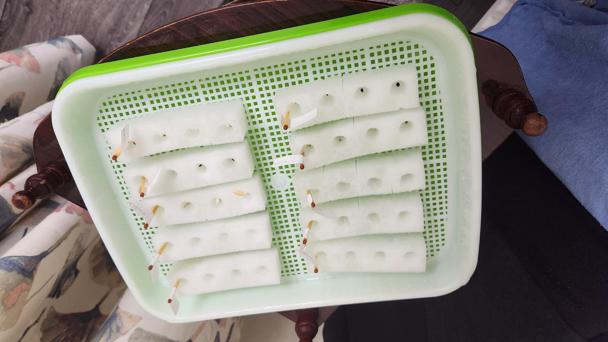
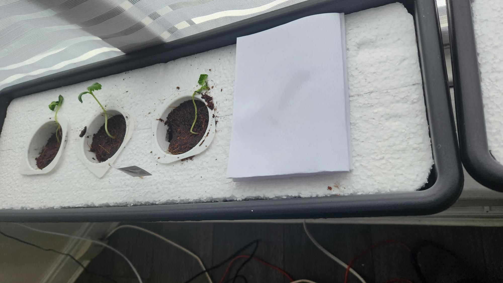

# Growing Step by Step

## Maintenance

The tray must be kept away from direct sunlight at the start of the germination period. I'm guessing this could be as much as 7-14 days. Once we have leaves we can move to direct sunlight to start the photo synthesis process.
The water level should be topped up at least once a day to just above the mesh whilst not submerging the seed.

## Stage 1

### Equipment

- Assortment of seeds
    - Beetroot
    - Cucumber
    - Lettuce - red and green
    - Pepper
    - Raddish
    - Rocket
    - Spring onion
    - Tomato - Golden Sunrise & Roma
- Small bucket!{}
- Hydroponic sponges
- Seed sprouting tray
- Seedling heat mat
- Toothpick labels

### Recipe

1. Create paper labels for each type of seed and attach to a toothpick label. This will later be used to identify the seeds when placed in the tray.
2. Partition the hydroponic sponges into rows so that each row will contain the same type of seed. I decided to use 4 seeds for each type to increase my chances of success. There are 10 types of seed, therefore I have 40 seeds in total.
3. Place the mesh in the tray and fill with water until the mesh is slightly submerged. The idea being to allow the sponge to absorb water without the seed drowning.
4. Each row of sponges should be soaked in water in the bucket and squeezed whilst submerged to ensure maximum absorbtion.
5. Place a label in each row and fill with 1 seed in each pocket.
6. Arrange the rows evenly on the tray mesh.
7. Place the tray on the mat and store in a warm dark area away from sunlight. Cover the tray if needed.

### Results

|Date| Comment
|--|--
|2023-01-16|Initial.
|2023-01-17|No change.
|2023-01-18|Life! [Cucumber](Image/2023-01-18//Cucumber.jpg), [raddish](Image/2023-01-18/Radish.jpg) and [rocket](Image/2023-01-18//Rocket.jpg) have sprouted.
|2023-01-19|[Red luttce](Image/2023-01-19/RedLettuce.jpg) has sprouted.
|2023-01-20|[Beetroot](Image/2023-01-20/Beetroot.jpg), [spring onion](Image/2023-01-20//SpringOnion.jpg) and [Tomato (GS)](Image/2023-01-20//Tomato(GS).jpg) have sprouted.
|2023-01-21|[Green Lettuce](Image/2023-01-21/GreenLettuce.jpg) and [Tomato (R)](Image/2023-01-21//Tomato(R).jpg) have sprouted.
|2023-01-22|Two of the three rocket seeds appear to have died.
|2023-01-23|Transition all seedlings to stage 2 (even if they haven't sprouted).

## Stage 2

### Equipment

- Large bucket
- Nutrients
- PH down
- PH meter
- PH up
- Syringes
- Seed sprouting tray
- Seedling heat mat
- Seedlings from stage 1
- TDS meter

### Recipe

We will be introducing the seedlings to nutients at half strength.

1. Fill the bucket with 2 litres or water. See the back of the bottles for nutrient concentration.
2. Add 2ml of FloraGro (green) nutrient to water and mix.
3. Add 2ml of FloraMicro (purple) nutrient to water and mix.
4. Add 2ml of FloraBloom (red) nutrient to water and mix.
5. Measure the pH of the water and use pH up or down accordingly. Target a pH of 6.0.
6. Measure the EC/ppm of the nutrients. My EC reading is 1600.
7. Arrange the seedlings evenly on the tray mesh.
8. Fill the tray so that the bottoms of all the sponges have water without drowning the roots.
9. Place the tray on the mat and store in a warm area in direct sunlight.
10. My pH reading after mixing the solution is 6.5 so I left it as is. We can use Ph up/down if needed.

### Results

|Date| Comment
|--|--
|2023-01-23|Initial.
|2023-01-24|The seeds that previosuly sprouted are now reaching toward the light. I've rotated the tray to see if they track the sunlight.
|2023-01-25|The skies were dark today, so nothing eventful happened.
|2023-01-26|Nothing to report.
|2023-01-27|I mixed another 2 litres of nutrient.
|2023-01-28|We have at least one of every type of seeding sprouting.
|2023-01-29|Nothing to report.
|2023-01-30|Nothing to report.
|2023-01-31|I may have damaged one of the cucumber plants by bening the stalk. Let's see if it recovers or dies.
|2023-02-01|Nothing to report.
|2023-02-02|Nothing to report.
|2023-02-03|Nothing to report.
|2023-02-04|I mixed another 2 litres of nutrient.
|2023-02-05|Nothing to report.
|2023-02-06|I wanted to transplant some of the seedlings to a trough but they haven't arrived yet. They are expected some time this week.
|2023-02-07|Nothing to report.
|2023-02-08|Nothing to report.
|2023-02-09|Nothing to report.
|2023-02-10|Nothing to report.
|2023-02-11|Transplanted cucumber seedlings.
|2023-02-12|I mixed another 2 litres of nutrient but this time increased to the growth stage.

## Stage 3

### Equipment

- Coconut husks
- Net pots
- Polystyrene board
- PH down
- PH meter
- PH up
- Syringes
- Seedlings from stage 2
- TDS meter
- 60cm Trough

### Recipe

1. Cut holes polystyrene boards so they they snuggly fit the troughs.
2. Cut 4 evenly spaced round holes to accomodate the net pots.
3. Fill each trough with 6 litres of water. The seedlings are now in the grwoth strage.
4. Add 10.8ml of FloraGro (green) nutrient to water and mix.
5. Add 7.2ml of FloraMicro (purple) nutrient to water and mix.
6. Add 3.6ml of FloraBloom (red) nutrient to water and mix.
7. Measure the pH of the water and use pH up or down accordingly. Target a pH of 6.0.
8. Measure the EC/ppm of the nutrients. My EC reading is 2100.
9. Transplant each seedling to the net pot and cover with coconut husk.
10. Add water to each pot to moisten.
11. Place pot into trough.

### Results

|Date| Comment
|--|--
|2023-02-11|Transplated 4 cucumber plants.
|2023-02-12|2 of the cucumber plants looks like they died.