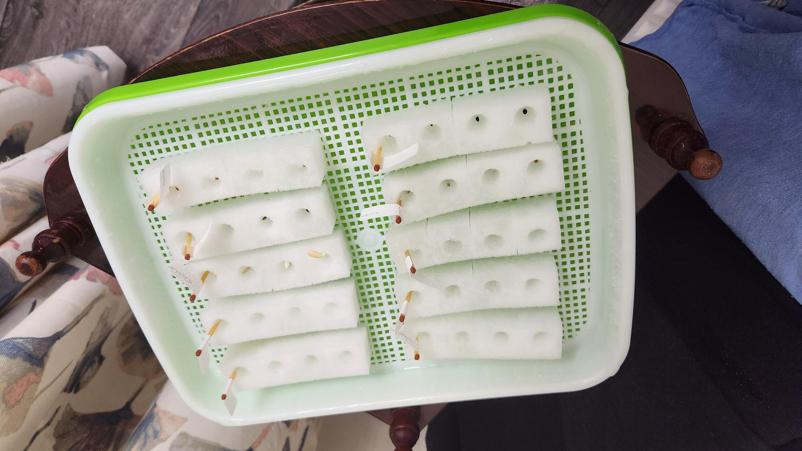

# Hydroponics

## Equipment

- Assortment of seeds
    - Beetroot
    - Cucumber
    - Green lettuce
    - Pepper
    - Raddish
    - Red lettuce
    - Rocket
    - Spring onion
    - Tomato (Golden Sunrise)
    - Tomato (Roma)
- Bucket
- Hydroponic sponges
- Seed sprouting tray
- Seedling heat mat
- Toothpick labels

## Process

1. Create paper labels for each type of seed and attach to a toothpick label. This will later be used to identify the seeds when placed in the tray.
2. Partition the hydroponic sponges into rows so that each row will contain the same type of seed. I decided to use 4 seeds for each type to increase my chances of success. There are 10 types of seed, therefore I have 40 seeds in total.
3. Place the mesh in the tray and fill with water until the mesh is slightly submerged. The idea being to allow the sponge to absorb water without the seed itself drowning.
4. Each row of sponges should be soaked in water in the bucket and squeezed whilst submerged to ensure maximum absorbtion.
5. Place a label in each row and fill with 1 seed in each pocket.
6. Arrange the rows evenly on the tray mesh.
7. Place the tray on the mat and store in a warm dark area away from sunlight. Cover the tray if needed.

## Timeline

The tray must be kept away from direct sunlight during the initial germination period. I'm guessing this could be as much as 7-14 days.
The water level should be topped up at least once a day to just avove the mesh whilst not submerging the seed.

|Date| Comment
|--|--
|2023-01-16| Initial.
|2023-01-17| No change.
|2023-01-18| Life! The [cucumber](Image/2023-01-18//Cucumber.jpg), [raddish](Image/2023-01-18/Radish.jpg) and [rocket](Image/2023-01-18//Rocket.jpg) have sprouted.