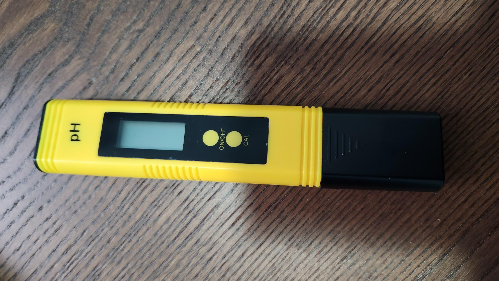
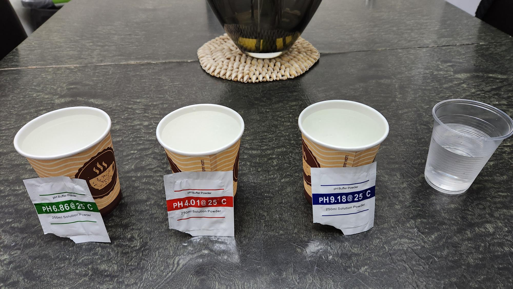

# How to Calibrate the pH Meter

## Equipment

- 250ml Beaker (4)
- pH buffer powder
    - 4.01
    - 6.86
    - 9.18
- Filter paper

## Recipe

1. Fill 4 beakers with 250ml of distilled water. Three of the beakers are for the buffer powder and one for cleaning the meter between calibrations.
2. Place each of the buffer powder sachets in front of the beakers as shown in the diagram. The order must 6.86, then 4.01 and lastly 9.18.
3. Disolve each of the buffer powder solutions into the water and keep the empty sachets by the beakers so that you don't foget which is which.
4. Rinse the meter with the clean beaker.
5. Switch on the pH meter.
6. Place the meter into the 6.86 solution, hold down the calibrate button until the screen flashes and reads 6.86.
7. Rinse the meter with the clean beaker.
8. Place the meter into the 4.01 solution, hold down the calibrate button until the screen flashes and reads 4.01.
9. Rinse the meter with the clean beaker.
10. Place the meter into the 9.18 solution, hold down the calibrate button until the screen flashes and reads 9.18.
11. Rinse the meter with the clean beaker and wipe it down.

